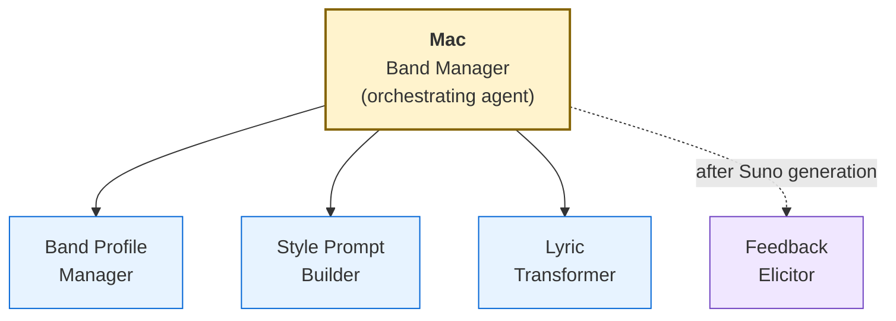

# Suno Agent — Mac, the Band Manager

An AI-powered music production assistant that helps you create professional Suno-ready song packages through guided creative conversation. Mac orchestrates four specialized skills into a seamless workflow: from initial inspiration to a complete package — style prompt, lyrics, and parameter recommendations — that you can paste directly into Suno.

## Features

You talk to Mac like you'd talk to a producer. Tell Mac what kind of song you want — a genre, a mood, a poem, a feeling, a reference track — and Mac produces a complete package:

- **Style Prompt** — Model-specific, optimized for your chosen Suno model (v4.5-all, v5 Pro, etc.)
- **Structured Lyrics** — With Suno metatags (`[Verse]`, `[Chorus]`, etc.), rhythmic consistency, and cliché detection
- **Exclusion Prompt** — What Suno should avoid
- **Parameter Recommendations** — Slider values, vocal gender, persona references (tier-aware)
- **Wild Card Variant** — An experimental alternative to push creative boundaries

After you try the output on Suno, Mac helps you refine through a structured feedback loop — translating subjective reactions ("it doesn't feel right") into concrete parameter adjustments.

### Highlights

- **Three Interaction Modes** — Demo (quick and scrappy), Studio (deep customization), Jam (experimental)
- **Band Profiles** — Persistent sonic identity across songs (genre, vocal direction, style baseline, writer voice)
- **Multi-Band Support** — Run multiple bands in one project, each with its own canonical playlist and analysis (per-band YAML files keep sequence data independent and drift-free)
- **Writer Voice Preservation** — Analyzes your writing samples to maintain your authentic voice when transforming lyrics
- **Tier-Aware** — Knows what's available on Free, Pro, and Premier plans; never shows features you can't access
- **Feedback Loop** — Five-type feedback triage with guided elicitation for users who can't articulate what's wrong
- **Playlist Sequencing & Album Craft** — Camelot wheel transitions, felt-BPM corrections, energy arc / W-shape analysis, locked-arc preservation, narrative-aware ordering across the full per-band catalog
- **Audio Analysis Toolkit** — Per-song deep analysis (BPM, key, energy arc, chord progression, section boundaries) with a JSON archive layer so you never re-run the same analysis twice, and auto-refreshed Markdown summary docs per band
- **Multi-Machine Workflow** — Portable sync archive moves your songbook, profiles, playlists, and analysis between machines; an audio-file manifest with size-tolerance + filename-normalization verification flags genuine gen differences without false-positiving Suno's per-download metadata variance
- **Instrumental Support** — Dedicated workflow for instrumental-only tracks
- **Non-English Support** — Language detection with Suno-specific guidance
- **Memory System** — Remembers your preferences, musical patterns, and creative history across sessions

## Quick Start

1. **Invoke Mac** — Use the trigger phrase "talk to Mac," "Band Manager," or "create a song for Suno"
2. **Tell Mac what you want** — "Make me a sad indie folk song" or paste a poem
3. **Get your package** — Mac produces a complete style prompt + lyrics + parameters
4. **Try it on Suno** — Paste into Suno's Custom Mode fields
5. **Come back and refine** — Tell Mac what worked and what didn't

For detailed documentation on all features, interaction modes, band profiles, the feedback loop, direct skill access, and headless/automation modes, see the [Usage Guide](src/skills/suno-agent-band-manager/references/USAGE.md).

## Architecture

Mac is an orchestrating agent that coordinates four specialized skills — three pre-generation, one post-generation:



The orchestrating agent and each skill have their own documentation:

| Component | Purpose | Key Scripts |
|-----------|---------|-------------|
| [**Mac (Band Manager)**](src/skills/suno-agent-band-manager/references/README.md) | Orchestrating agent — guides the full song creation workflow across all skills | `pre-activate.py`, `validate-path.py`, `check-memory-health.py` |
| [**Band Profile Manager**](src/skills/suno-band-profile-manager/references/README.md) | CRUD for band identity profiles, writer voice analysis, tier feature awareness | `validate-profile.py`, `list-profiles.py`, `tier-features.py`, `diff-profiles.py` |
| [**Style Prompt Builder**](src/skills/suno-style-prompt-builder/references/README.md) | Model-aware style prompt generation with creativity modes and wild card variants | `validate-prompt.py` |
| [**Lyric Transformer**](src/skills/suno-lyric-transformer/references/README.md) | Poem/text to Suno-ready structured lyrics with metatags and cliché detection | `validate-lyrics.py`, `cliche-detector.py`, `syllable-counter.py`, `analyze-input.py`, `section-length-checker.py`, `lyrics-diff.py` |
| [**Feedback Elicitor**](src/skills/suno-feedback-elicitor/references/README.md) | Post-generation feedback triage and guided refinement with musical vocabulary translation. Also hosts the audio-analysis toolkit, playlist sequencing, and multi-machine audio verification scripts | `parse-feedback.py`, `map-adjustments.py`, `analyze-audio.py`, `audio-deep-analysis.py`, `batch-full-analysis.py`, `chord-progression.py`, `tempo-detail.py`, `playlist-sequencing-data.py`, `audio-files-manifest.py`, `verify-audio-files.py` |

Each skill can be invoked directly for standalone use — see the linked READMEs for details, headless modes, and examples.

### Per-band playlist sequencing methodology

Each band has a canonical `docs/{band-slug}-playlist.yaml` as its single source of truth. The `playlist-sequencing-data.py` script reads it and produces:

- A persistent JSON archive at `docs/audio-analysis/playlists/{band-slug}.json` (durable raw data — read it directly to answer different questions of the same audio without re-running)
- An auto-refreshed Markdown summary at `docs/{band-slug}-playlist-sequencing.md` (Camelot transitions, energy levels, intro/outro percentages, transition quality)

The album-craft methodology (per-track variables, energy arc models including W-shape, key positions, locked-arc preservation, sonic palette variety, encore structure) is documented at [`src/skills/suno-feedback-elicitor/references/playlist-sequencing-methodology.md`](src/skills/suno-feedback-elicitor/references/playlist-sequencing-methodology.md). Multi-band projects keep each band's playlist independent — there's no shared global file that drifts between bands.

For multi-machine projects, `audio-files-manifest.py` generates a small `docs/audio-files-manifest.yaml` (audio MP3s are too large to ship in the sync archive) and `verify-audio-files.py` runs on the receiving machine after sync-unpack to flag missing / wrong-gen / extra files. The verifier is filename-normalization-aware (`Foo.mp3` ≡ `Foo-Redux.mp3` ≡ `Foo (NSFW).mp3` for song-identity matching) and size-tolerance-aware (absorbs Suno's per-download ID3 metadata variance so identical-audio doesn't false-positive as different gen).

## Prerequisites

- **An LLM CLI with skill support** — Claude Code, Gemini CLI, Codex CLI, GitHub Copilot, Windsurf, or OpenCode
- **Suno account** (free tier works; Pro/Premier unlocks additional features)
- **BMad Method** (optional) — Mac was built with BMad and can be installed as a BMad module, but runs independently without it

### Optional: Audio Analysis

For objective audio measurements, install:

```bash
pip install librosa numpy
```

This unlocks:

- **Per-song deep analysis** — BPM, key (Krumhansl-Kessler), energy arc, chord progression, section boundaries, spectral balance
- **Playlist sequencing** — Camelot wheel transitions, entry/exit keys, intro/outro energy, BPM transition quality across the full per-band playlist
- **Catalog-wide batch analysis** — tempo stability, dynamic character (FLAT / MODERATE / DYNAMIC / HIGHLY-DYNAMIC), energy shifts >20%, section boundary detection across every track at once
- **JSON archive layer** — every analysis is persisted to `docs/audio-analysis/{songs,playlists,catalog}/` so future sessions read the archive instead of re-running the script
- **Auto-refreshed Markdown summaries** — each script writes a human-readable companion doc (per-band for playlist sequencing, catalog-wide for the others) that auto-refreshes between AUTOGEN markers; hand-curated content outside the markers is preserved
- **Multi-machine audio file verification** — `audio-files-manifest.py` + `verify-audio-files.py` close the audio-drift gap when MP3s are too large to ship in the portable sync archive

These are all optional — the full song creation and refinement workflow works without librosa/numpy. Mac will offer to help install if you try to use audio analysis features without them.

## Installation

### Standalone (any supported LLM CLI)

```bash
git clone https://github.com/zarlor/suno-band-manager.git
cd suno-band-manager
./link-skills.sh
```

The link script creates symlinks in both `.claude/skills/` and `.agents/skills/` — the portable [Agent Skills](https://agentskills.io) standard supported by Claude Code, Gemini CLI, Codex CLI, GitHub Copilot, Windsurf, and OpenCode.

Then activate Mac using your LLM CLI's skill invocation (e.g., `/suno-agent-band-manager` in Claude Code). On first run, Mac walks you through setup — Suno tier, interaction mode, preferences.

### With BMad Method — install from the community marketplace

If you use [BMad Method](https://github.com/bmad-code-org/BMAD-METHOD/) (v6.2.0+), the easiest path is the marketplace install:

```bash
npx bmad-method install
```

When the installer asks **"Would you like to browse community modules?"**, answer yes, drill down to **Design and Creative → Audio**, and select **Suno Band Manager**. The installer clones the module from GitHub, links the skills, and walks you through setup automatically.

#### Local clone install (alternative)

If you've already cloned this repo (for development or to use unreleased commits ahead of the marketplace registry's approved version):

```bash
git clone https://github.com/zarlor/suno-band-manager.git
cd suno-band-manager
npx bmad-method install         # Install BMad if not already present
./link-skills.sh                # Link Suno skills
/suno-setup                     # Configure via setup skill
```

BMad provides additional module infrastructure (config management, help system registration) but is not required for core functionality.

For detailed installation instructions including per-tool notes, standalone configuration, and troubleshooting, see [INSTALLATION.md](INSTALLATION.md).

### Start using Mac

On first activation, Mac will greet you and confirm your setup. All preferences are changeable anytime through conversation — just tell Mac "I upgraded to Pro" or "make Studio my default mode."

## Updating

### Updating the Suno module

```bash
git pull
```

That's it. Your symlinks point into `src/skills/`, so changes are picked up immediately. If the update includes new config options or a version bump, re-run setup to apply them:

```
/suno-setup
```

The setup skill detects your existing config and uses your saved values as defaults. Your preferences, band profiles, songbook, and memory are all preserved.

### After a BMad Method upgrade (BMad users only)

Running `npx bmad-method install` replaces the contents of `.claude/skills/` with BMad's own skills. This removes the Suno symlinks but does **not** affect your module source, config, or data. Your `.agents/skills/` symlinks are unaffected.

To restore:

```bash
./link-skills.sh          # Re-creates .claude/skills/ symlinks
/suno-setup          # Re-registers help entries if needed
```

## Multi-LLM Compatibility

Mac follows the [Agent Skills](https://agentskills.io) open standard. The `link-skills.sh` script creates symlinks in `.agents/skills/` (the portable standard) alongside `.claude/skills/`:

| LLM CLI | Skill Discovery Path | Status |
|---------|---------------------|--------|
| Claude Code | `.claude/skills/`, `.agents/skills/` | Fully supported |
| Gemini CLI | `.agents/skills/`, `.gemini/skills/` | Compatible |
| Codex CLI | `.agents/skills/` | Compatible |
| GitHub Copilot | `.agents/skills/`, `.github/skills/` | Compatible |
| Windsurf | `.agents/skills/`, `.windsurf/skills/` | Compatible |
| OpenCode | `.agents/skills/`, `.opencode/skills/` | Compatible |
| Cursor | `.cursor/skills/` (copy, not symlink) | Manual setup required |

Mac was developed and tested primarily on Claude Code. Other LLM CLIs should work with the same SKILL.md format but may have differences in tool permissions, agent spawning, or skill activation UX.

## Suno Model Compatibility

Mac supports Suno models from v4 through v5.5 Pro, with model-specific prompt optimization and character limit enforcement. See the [Suno Reference](src/skills/suno-agent-band-manager/references/SUNO-REFERENCE.md) for models, plans, and prompting, and the [Studio & Editor Reference](src/skills/suno-agent-band-manager/references/STUDIO-EDITOR-REFERENCE.md) for post-generation editing (Legacy Editor, Studio, Stems, Warp Markers, and more).

## File Structure

```
src/skills/
├── suno-setup/                # Module setup and configuration
│   ├── SKILL.md                    # Setup skill — config collection and registration
│   ├── assets/
│   │   ├── module.yaml             # Module metadata and config variables
│   │   └── module-help.csv         # Capability registry (v1.4.0 format)
│   └── scripts/
│       ├── merge-config.py         # Config file merge + init-compatible output
│       ├── merge-help-csv.py       # Help CSV merge
│       └── cleanup-legacy.py       # Legacy file cleanup
├── suno-agent-band-manager/   # Mac — orchestrating agent
│   ├── SKILL.md                    # Agent persona, activation, orchestration
│   ├── bmad-skill-manifest.yaml    # Skill type identifier
│   ├── references/
│   │   ├── create-song.md          # Main song creation workflow
│   │   ├── refine-song.md          # Post-generation refinement loop
│   │   ├── browse-songbook.md      # Creative history browsing
│   │   ├── save-memory.md          # Session persistence
│   │   ├── init.md                 # First-run setup
│   │   ├── memory-system.md        # Memory discipline and structure
│   │   ├── SUNO-REFERENCE.md       # Suno platform reference
│   │   ├── STUDIO-EDITOR-REFERENCE.md
│   │   └── USAGE.md                # End-user guide (canonical location)
│   └── scripts/
│       ├── pre-activate.py         # First-run detection, scaffolding, menu rendering
│       ├── validate-path.py        # Access boundary enforcement
│       └── check-memory-health.py  # Memory file size monitoring
├── suno-band-profile-manager/ # Band profile CRUD and writer voice analysis
├── suno-style-prompt-builder/ # Model-aware style prompt generation
├── suno-lyric-transformer/    # Poem/text to Suno-ready lyrics
├── suno-feedback-elicitor/    # Post-generation feedback refinement
└── _shared/                        # Shared Python utilities
```

## License

MIT — see [LICENSE](LICENSE) for details.

## Credits

Built with the [BMad Method](https://github.com/bmad-code-org/BMAD-METHOD/) — Build More, Architect Dreams. Mac's agent architecture, skill structure, and module system are powered by BMad's framework and builder tools. The module runs independently of BMad but owes its DNA to BMad's approach to outcome-driven AI agent design.
